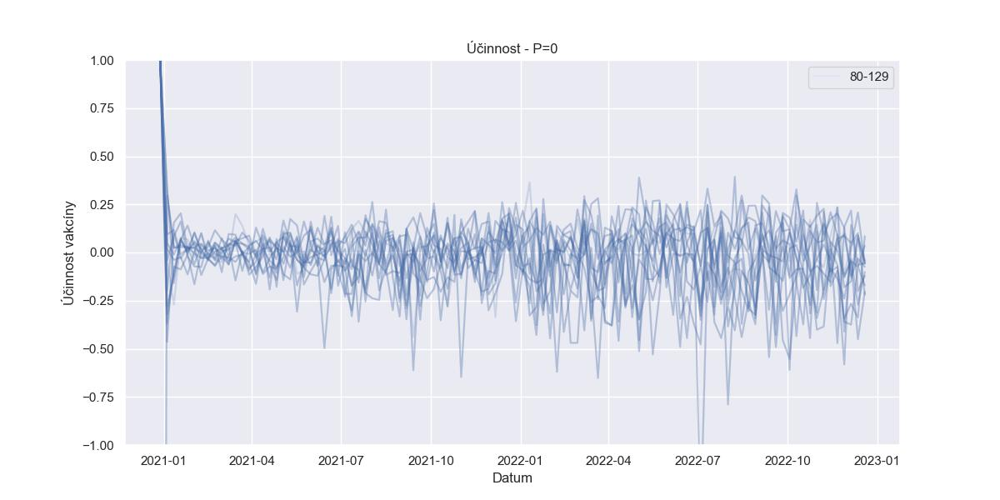
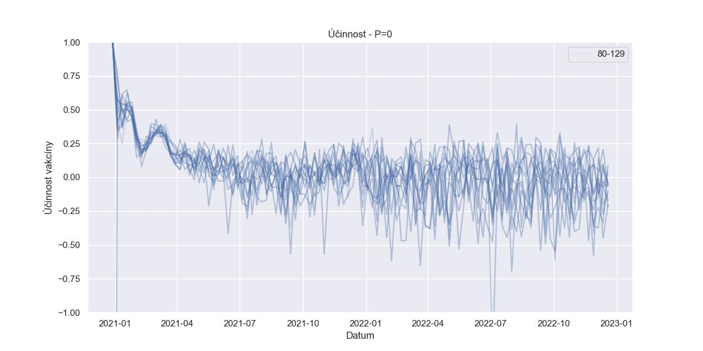

# Covid model

## Data
- https://www.czso.cz/documents/142154812/176236044/sldb2021_pv_vek_pohlavi.xlsx
- https://onemocneni-aktualne.mzcr.cz/api/v2/covid-19/ockovani-demografie.csv
- https://www.czso.cz/documents/10180/179851740/demomigr_2005_2021_komplet.zip/
- https://www.czso.cz/documents/10180/179851750/demomigr_2022_predbezna_2022t51.zip/

## Modelované dle reality

- Struktura společnosti ze Sčítání lidu 2021
- Vakcinace z oficiálních dat z ÚZISU
- Počty úmrtí od ČSÚ
- Přecházení mezi jednotlivými věkovými skupinami v čase + rození lidí

## Parametr P
- pokud **P = 0** - umírání vakcinovaných i nevakcinovaných probíhá rovnoměrně
- pokud **P > 0** - nevakcinovaní umírají více na úkor vakcinovaných (efekt vypadám na umření/skoro umírám => není logické, abych se šel očkovat a ještě se ohrožoval)

## Ukázkový výstup 

### Účinnost vakcín

#### P = 0

#### P = 0.5

